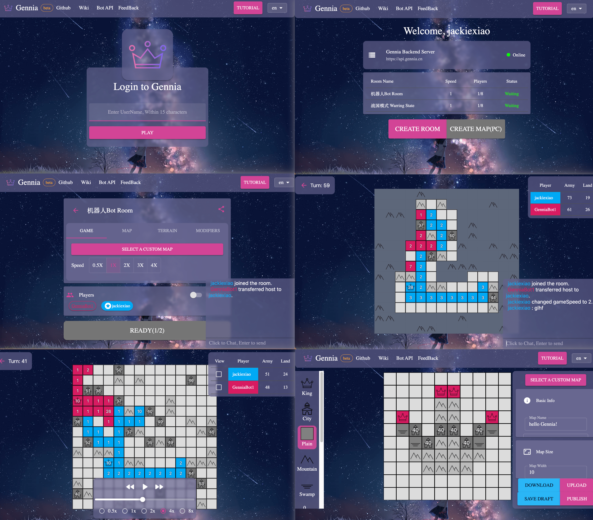
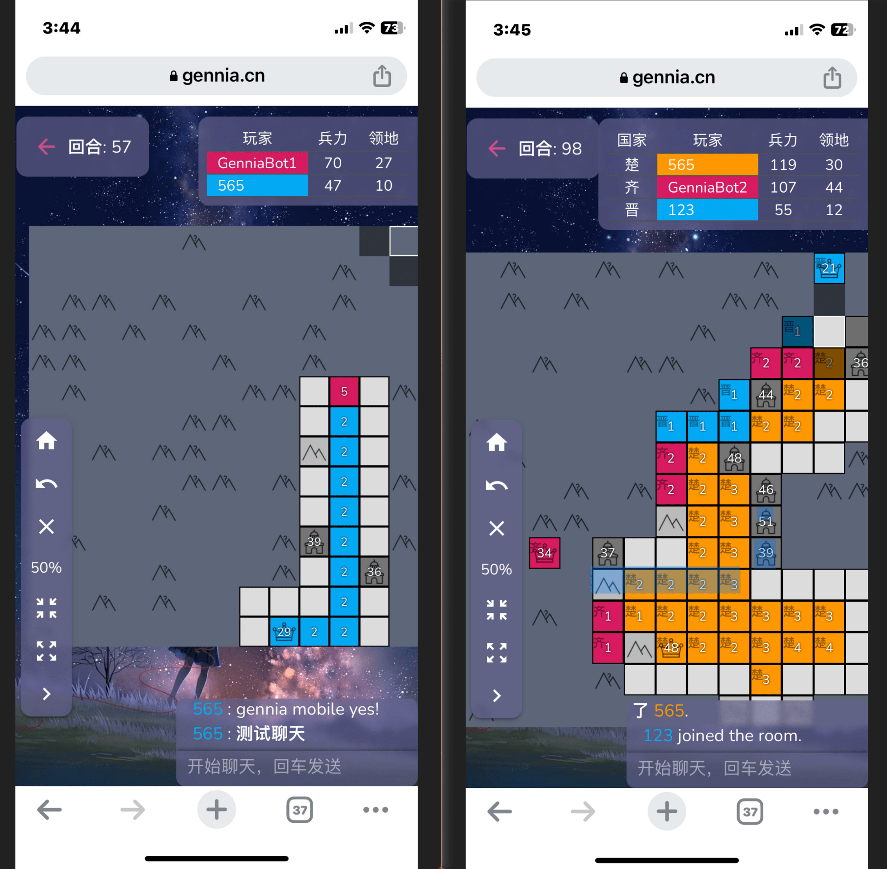

## GenniaServer 2

<h1 align="center">
  
  <br>
  
</h1>

> [Gennia](https://gennia.online): Yet another generals.io clone server & client

<h5 align="center">


Gennia PC demo



Gennia Mobile demo

</h5>

What is GenniaServer 2?

- A realtime multiplayer game where the goal is to capture all of the enemy's general without losing your own
- using react/nextjs/socket/express
- inspired by [generals.io](https://generals.io), the game mode will be different from generals.io in the future.

## How to Play

Your goal is to capture other generals.

- Plains produce one unit every 25 turns
- Cities and generals produce one unit every turn
- You can move twice per turn.
- When you capture the enemy general, all his territory belongs to you and his army strength is halved and becomes yours.

| function           | keyboard     |
| ------------------ | ------------ |
| Move Around        | WSAD         |
| Move On Mobile     | Touch & Drag |
| Open Chat          | Enter        |
| Undo Move          | e            |
| Clear Queued Moves | q            |
| Select on general  | g            |
| Center on home     | h            |
| Center Map         | c            |
| Toggle 50%         | z            |
| Set Zoom to Preset | 1 / 2 / 3    |
| Zoom in / out      | mouse wheel  |
| Surrender          | escape       |

## Supported Feature

### Basic

- [x] Create Custom Map
- [x] [Game Bot](https://github.com/GenniaApp/GenniaBot)
- [x] Replays
- [x] Mobile Support (Drag to attack)
- [x] Lobby & Custom Game
- [x] Room Chat
- [ ] Team

### Game Modifier

- [x] Fog of War
- [x] Spectator
- [x] Warring States (Reveal all King)
- [ ] Move All Armys
- [ ] Movable King

## Development

### client: nextjs

First, run the development server:

```bash
cd client/
pnpm install
pnpm run dev
```

Open [http://localhost:3000](http://localhost:3000) with your browser to see the result.

### server: express + socket.io

ps: server side code init from [template](https://github.com/nisicadmir/nodejs-typescript/tree/master/tutorial-5)

```bash
cd server/
pnpm install
pnpm run dev
```

#### database

We use postgresql + prisma

- see `.env.example` to config prisma env correctly
- if you init repo or edit prisma schema, run `npx prisma migrate dev` to make sure update schema in database and update prisma client

```
npx prisma generate # generate prisma client code
npx prisma migrate dev # migrate
pnpm dlx prisma studio # open databaseUI
```

#### docker

- setup postgresql and pyadmin to manage data

```
docker-compose up -d
```

## Deployment

- [PM2](https://pm2.keymetrics.io/docs/usage/quick-start/) is a production process manager for Node.js applications, which is very easy to use.
- docker-compose: for setup database

- see `make deploy` and `make restart` in Makefile
- to set the application to restart on startup see: https://pm2.keymetrics.io/docs/usage/startup/

## [Roadmap](https://github.com/orgs/GenniaApp/projects/1)

## JoinUs

- QQ Group : 374889821
- [Discord](https://discord.gg/p9BfpwBF)

## License

Distributed under the GNU GENERAL PUBLIC LICENSE VERSION 3. See `LICENSE.txt` for more information.

## Acknowledgments

- [MadJS](https://github.com/fluffybeastgames/MadJS/)
- [generals-io-webapp](https://github.com/dhyegocalota/generals-io-webapp)
